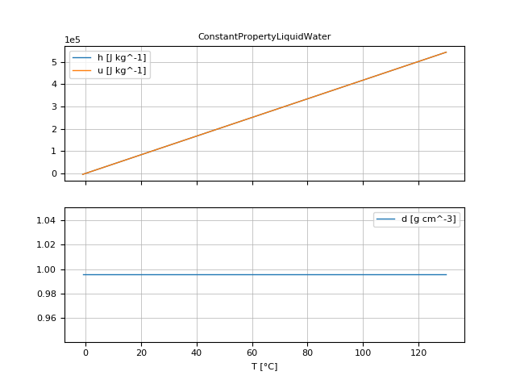
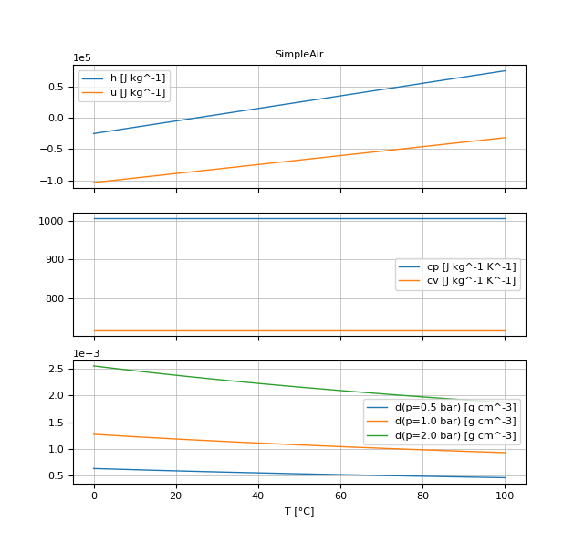
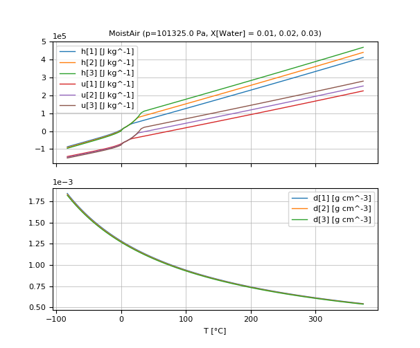

# Media Types

In this section the currently available media types are summarized.
The [Available media](@ref) list the actually available media.
A concrete medium object is inquired with [`getMedium`](@ref)`(mediumName)`.


## SimpleMedium

[`PureSubstance`](@ref) thermodynamic property model with linear dependency of specific internal energy and specific enthalpy
from temperature. All other quantities, especially density, are constant. Example:

```julia
# Definition of medium in ModiaMedia/dict/SimpleMedium.jl
dict["ConstantPropertyLiquidWater"] = ModiaMedia.SimpleMedium(
                        mediumName = "ConstantPropertyLiquidWater",

                        fluidConstants = ModiaMedia.BasicFluidConstants(
                            chemicalFormula="H2O",
                            structureFormula="H2O",
                            casRegistryNumber="7732-18-5",
                            iupacName="oxidane",
                            molarMass=0.018015268),

                        data = ModiaMedia.SimpleMediumData(
                            cp_const=4184,
                            cv_const=4184,
                            d_const=995.586,
                            eta_const=1.e-3,
                            lambda_const=0.598,
                            a_const=1484,
                            T_min=ModiaMedia.from_degC(-1),
                            T_max=ModiaMedia.from_degC(130),
                            T0=273.15,
                            MM_const=0.018015268)
                    )


# Using this medium
using ModiaMedium
standardPlot( getMedium("ConstantPropertyLiquidWater") )
```




## SimpleIdealGasMedium

[`PureSubstance`](@ref) thermodynamic property model of ideal gas with linear dependency of specific
internal energy and specific enthalpy from temperature and constant transport
properties. Density is a function of temperature and pressure.
Example:

```julia
# Definition of medium in ModiaMedia/dict/SimpleIdealGasMedium.jl
dict["SimpleAir"] = ModiaMedia.SimpleIdealGasMedium(
                        mediumName = "SimpleAir",

                        fluidConstants = ModiaMedia.BasicFluidConstants(
                            iupacName="simple air",
                            casRegistryNumber="not a real substance",
                            chemicalFormula="N2, O2",
                            structureFormula="N2, O2",
                            molarMass=0.0289651159),

                        data = ModiaMedia.SimpleIdealGasMediumData(
                            cp_const     = 1005.45,
                            MM_const     = 0.0289651159,
                            R_gas        = 8.3144598/0.0289651159,
                            eta_const    = 1.82e-5,
                            lambda_const = 0.026,
                            T_min        = ModiaMedia.from_degC(0.0),
                            T_max        = ModiaMedia.from_degC(100.0),
                            T0           = 298.15)
                    )


# Using this medium
using ModiaMedium
standardPlot( getMedium("SimpleAir") )
```




## SingleGasNasa

[`PureSubstance`](@ref) thermodynamic property model of ideal gas with nonlinear functions for
specific enthalpy and specific internal energy.
Density is a function of temperature and pressure, whereas all other functions
are a function of temperature only. The nonlinear function for specific enthalpy
and its data are from

- McBride B.J., Zehe M.J., and Gordon S. (2002):
  **NASA Glenn Coefficients for Calculating Thermodynamic Properties of Individual Species**.
  NASA report TP-2002-211556

```julia
# Using this medium
using ModiaMedium
standardPlot( getMedium("N2") )
```


## MoistAir

#### Thermodynamic Model

[` CondensingGases`](@ref) thermodynamic property model of moist air including the
fog region and temperatures below zero degC. The governing assumptions in this model are:

- the perfect gas law applies
- water volume other than that of steam is neglected

All extensive properties are expressed in terms of the total mass in order to comply with other media in this library. However, for moist air it is rather common to express the absolute humidity in terms of mass of dry air only, which has advantages when working with charts. In addition, care must be taken, when working with mass fractions with respect to total mass, that all properties refer to the same water content when being used in mathematical operations (which is always the case if based on dry air only). Therefore two absolute humidities are computed in the BaseProperties model: X denotes the absolute humidity in terms of the total mass while x denotes the absolute humidity per unit mass of dry air. In addition, the relative humidity phi is also computed.

At the triple point temperature of water of 0.01 °C or 273.16 K and a relative humidity greater than 1 fog may be present as liquid and as ice resulting in a specific enthalpy somewhere between those of the two isotherms for solid and liquid fog, respectively. For numerical reasons a coexisting mixture of 50% solid and 50% liquid fog is assumed in the fog region at the triple point in this model.


#### Range of validity

From the assumptions mentioned above it follows that the pressure should be in the region around atmospheric conditions or below (a few bars may still be fine though). Additionally a very high water content at low temperatures would yield incorrect densities, because the volume of the liquid or solid phase would not be negligible anymore. The model does not provide information on limits for water drop size in the fog region or transport information for the actual condensation or evaporation process in combination with surfaces. All excess water which is not in its vapour state is assumed to be still present in the air regarding its energy but not in terms of its spatial extent.

The thermodynamic model may be used for temperatures ranging from 190 ... 647 K. This holds for all functions unless otherwise stated in their description. However, although the model works at temperatures above the saturation temperature it is questionable to use the term "relative humidity" in this region. Please note, that although several functions compute pure water properties, they are designed to be used within the moist air medium model where properties are dominated by air and steam in their vapor states, and not for pure liquid water applications.


#### Transport Properties
Several additional functions that are not needed to describe the thermodynamic system, but are required to model transport processes, like heat and mass transfer, may be called. They usually neglect the moisture influence unless otherwise stated.


#### Application

The model's main area of application is all processes that involve moist air cooling under near atmospheric pressure with possible moisture condensation. This is the case in all domestic and industrial air conditioning applications. Another large domain of moist air applications covers all processes that deal with dehydration of bulk material using air as a transport medium.


#### Usage

```julia
# Using this medium
using ModiaMedium
standardPlot( getMedium("MoistAir") )
```



